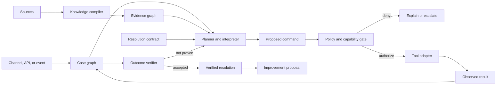

# Ergon Architecture

> **TL;DR:** Start with a Kotlin modular monolith, two asynchronous workers, a
> React application, and PostgreSQL. Keep the domain free of Spring, persistence,
> transport, model, and connector dependencies. Probabilistic components
> interpret and propose; deterministic components own authority, execution, and
> verification.

## Runtime view



## Dependency rule

Dependencies point inward. Applications and infrastructure adapters may depend
on application and domain modules; domain modules depend on neither. Domain code
contains no Spring, JPA, JSON, HTTP, Kafka, model-provider, or connector types.

Protocol parsing identifies source observations and preserves their origin.
Semantic binding attributes those observations to typed asset properties.
Neither layer imports the other layer's infrastructure adapters. They
communicate through application ports and domain values so parsing, binding,
and provider choices can evolve independently.

Transport DTOs, persistence records, event envelopes, model schemas, and domain
objects are separate types. Mapping at boundaries is intentional.

## Logical modules

| Module | Owns |
|---|---|
| `identity` | tenants, actors, subjects, memberships, and authorization context |
| `cases` | case commands, events, graph projection, lifecycle, and handoff |
| `evidence` | observations, facts, claims, provenance, validity, and contradictions |
| `contracts` | DSL, validation, revisions, compatibility, and promotion |
| `runtime` | runs, step state, waits, retries, idempotency, and compensation |
| `policy` | capabilities, risk, grants, denials, approvals, and receipts |
| `knowledge` | source ingestion, extraction, indexing, and evidence bundles |
| `evaluation` | fixtures, replay, assertions, comparisons, and release gates |
| `connectors` | model, tool, channel, object-store, and event adapters |

Cross-module behavior uses explicit application ports or domain events. A module
does not read or write another module's tables as an informal API.

## Deployables

| Deployable | Responsibility |
|---|---|
| `control-plane` | APIs for cases, evidence, contracts, policies, approvals, tenancy, and projections |
| `runtime-worker` | Durable execution, timers, retries, tool calls, compensation, and verification |
| `compiler-worker` | Ingestion, parsing, semantic binding, extraction, contradiction detection, and indexing |
| `web` | Resolver console, resolution studio, simulation lab, and end-user portal |
| `widget-sdk` | Headless client and web components for the adaptive canvas |

Keep backend modules in one repository. Begin with three backend processes and
one PostgreSQL cluster with explicit schema ownership. Split further only when
measured load, security isolation, or independent release cadence justifies the
operational cost.

## Source layout target

```text
apps/
  control-plane/
  runtime-worker/
  compiler-worker/
  web/
modules/
  identity/
  cases/
  evidence/
  contracts/
  runtime/
  policy/
  knowledge/
  evaluation/
adapters/
  models/
  tools/
  channels/
packages/
  contract-dsl/
  widget-sdk/
  testkit/
deploy/
docs/
examples/
```

This is a target, not permission to create empty modules. A directory appears
only when a vertical slice needs it.

## Persistence

- PostgreSQL is authoritative for tenants, cases, evidence metadata, contracts,
  runs, approvals, event streams, projections, and pgvector indexes.
- Object storage holds source binaries and large evidence objects.
- A transactional outbox publishes externally relevant domain events.
- Kafka carries asynchronous compilation and connector work; it is not the
  event store or a required hop between cohesive modules.
- Redis may support ephemeral rate limits or coordination; critical state must
  survive its loss.
- Flyway owns production schema changes. ORM auto-DDL is disabled outside
  disposable tests.

Event sourcing is reserved for cases and resolution runs, where temporal replay
and audit are product capabilities. Other configuration uses ordinary versioned
tables unless an ADR establishes a replay requirement.

## Trust boundaries

- Treat user content, retrieved sources, model output, connector metadata, and
  tool descriptions as untrusted.
- Models produce typed proposals. A deterministic policy engine evaluates the
  pinned actor, tenant, contract, evidence, capability, and risk.
- Credentials are injected after authorization and are never placed in model
  context, events, logs, or action receipts.
- External writes require idempotency and return a durable receipt. A retry must
  not repeat a completed effect.
- High-risk or irreversible actions require explicit human authority defined by
  policy, not model confidence.
- Verification is independent of the component that performed the action when
  a separate observation is possible.
- All storage keys, searches, joins, cache keys, and capabilities preserve
  tenant scope.

## Contract and event compatibility

Resolution runs pin immutable revisions. Published contract revisions, event
schemas, public APIs, and persisted value meanings never change in place.
Compatible additions use explicit defaults; breaking changes require a new
version, migration strategy, and ADR.

Representative events include `CaseOpened`, `EvidenceObserved`, `FactDisputed`,
`ContractSelected`, `RunStarted`, `StepProposed`, `ActionAuthorized`,
`ActionExecuted`, `ApprovalRequested`, `HumanIntervened`, `OutcomeObserved`,
`ResolutionVerified`, `CaseEscalated`, `ImprovementProposed`, and
`RevisionPromoted`.

Events describe completed facts in past tense. Commands express intent. Event
payloads contain enough immutable context for their supported consumers without
turning the event bus into a shared database.

## Observability

Every request, case, run, contract revision, and step has a stable identifier.
OpenTelemetry context crosses HTTP, asynchronous work, and tool calls. Logs are
structured and exclude secrets, raw credentials, and unnecessary personal data.
Metrics avoid tenant, case, user, or document identifiers as labels.

Operational signals include queue and outbox lag, stuck steps, retries,
compensations, policy denials, approval age, tool and model latency, evidence
freshness, verification latency, and unverified closure attempts.

## Decisions retained from the predecessor

The old ADRs remain as superseded history. Their reusable principles—separate
event and persistence time, domain-owned validation, transactional outbox,
at-least-once idempotency, immutable integration snapshots, and evaluated
ranking policy—must be reconsidered in Ergon's domain before reuse. They do not
silently govern the rewrite.
